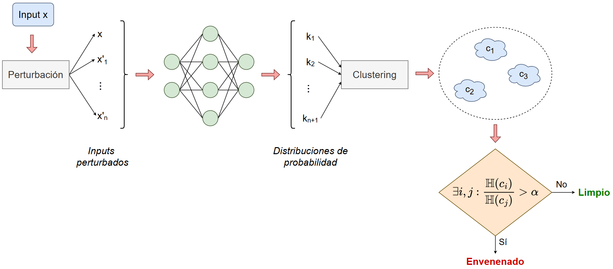
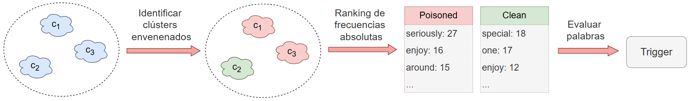

# EntroClust

Implementation of my MSc thesis project, consisting in the development of a backdoor detection method for LLMs. The repository is divided into two main folders:

- ``utils`` contains the Python code necessary to deploy the defense mechanism, as well as to inject a simple backdoor into a classification and an instruction-following dataset.
- ``notebooks`` contains the Jupyter notebooks that were used to train the models, test the defense method and generate the charts and visualizations used in the thesis.

EntroClust consists of two algorithms: 

1. Poison detection: during inference time, it detects whether an input is poisoned (i.e. contains a trigger) or not. This process is based on three key elements: (1) the creation of perturbed versions of the input text, (2) the clustering of the probability distributions generated by those versions and (3) analysing the difference in the mean entropy of the clusters. These are summarized in the image below: 

2. Trigger identification: on poisoned inputs, it identifies which words are part of the trigger based on a series of evaluation metrics, such as the mutual information or the log odds-ratio. A brief summary of this process is shown below: 